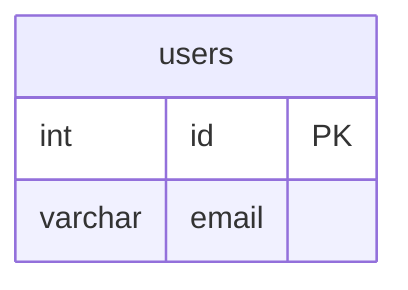
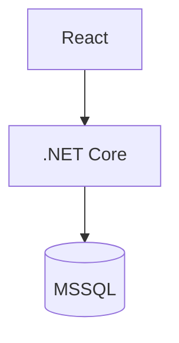

# 상세문서 작성 가이드

상세문서는 특정 기능이나 설계에 대한 모든 정보를 담는 문서다.
`index.md`에서 경로를 확인한 뒤 이 문서를 읽어 상세 내용을 파악한다.

---

## 상세문서 구성 순서

반드시 아래 순서를 지켜라:

```
1. 메타데이터 블록
2. 문서 제목
3. 문서 내 목차 (섹션명 + 줄 번호)
4. 본문 (각 섹션)
5. 연관문서
```

---

## 상세문서 템플릿

```markdown
---
작성일: YYYY-MM-DD
최종수정: YYYY-MM-DD
버전: v1.0
---

# [문서 제목]

## 목차

| 섹션 | 줄 번호 |
|---|---|
| [개요](#개요) | L10 |
| [섹션명](#섹션-앵커) | L20 |
| [섹션명](#섹션-앵커) | L35 |
| [연관문서](#연관문서) | L55 |

---

## 개요

[이 문서가 다루는 내용을 2~3문장으로 요약]

---

## [섹션명]

[본문 내용]

---

## 연관문서

| 문서 | 경로 | 설명 |
|---|---|---|
| [문서 제목] | `../[기능폴더]/[파일명].md` | [이 문서와의 관계 설명] |
```

---

## 목차 작성 규칙

목차는 **섹션명 + 실제 줄 번호** 를 표로 표현한다.

```markdown
## 목차

| 섹션 | 줄 번호 |
|---|---|
| [개요](#개요) | L10 |
| [테이블 정의](#테이블-정의) | L18 |
| [관계 정의](#관계-정의) | L42 |
| [연관문서](#연관문서) | L60 |
```

- 줄 번호는 해당 `##` 헤더가 위치한 실제 줄 번호
- 문서 수정 후 줄 번호가 달라지면 반드시 재계산해서 업데이트
- 앵커 링크는 헤더를 소문자로 변환, 공백은 `-`로 치환

---

## 연관문서 작성 규칙

```markdown
## 연관문서

| 문서 | 경로 | 설명 |
|---|---|---|
| ERD 설계서 | `../db/erd.md` | 이 API에서 사용하는 테이블 구조 |
| 인증 흐름 설계 | `../user-auth/auth-flow.md` | 토큰 검증 로직 참고 |
```

- 경로는 현재 문서 기준 상대 경로
- 설명은 "왜 연관됐는지" 를 한 줄로 표현
- 상세문서 추가/수정 시 경로 유효성 반드시 확인
- 유효하지 않은 경로: `⚠️ 경로 확인 필요` 표기 후 사용자에게 알림

---

## 문서 유형별 본문 섹션 가이드

문서 유형에 따라 본문에 포함할 섹션이 다르다.

### ERD 문서

```markdown
## 개요
[DB 목적, 사용 DBMS]

## 테이블 목록

| 테이블명 | 한국어명 | 설명 |
|---|---|---|
| users | 사용자 | 서비스 이용자 정보 |

## 테이블 상세

### [테이블명]

| 컬럼명 | 타입 | NULL | 기본값 | 설명 |
|---|---|---|---|---|
| id | INT | NO | AUTO | PK |

## 관계 정의

| 관계 | 유형 | 설명 |
|---|---|---|
| users → orders | 1:N | 한 사용자는 여러 주문 가능 |

## ERD 다이어그램


```

---

### 아키텍처 문서

```markdown
## 개요
[시스템 목적, 전체 구조 요약]

## 시스템 구성도



## 컴포넌트 정의

| 컴포넌트 | 기술 | 역할 | 포트 |
|---|---|---|---|
| Frontend | React + Vite | UI | 5173 |

## API 엔드포인트 개요

| 메서드 | 경로 | 설명 | 인증 |
|---|---|---|---|
| GET | /api/users | 사용자 목록 | Y |
```

---

### 회의록

```markdown
## 회의 정보

| 항목 | 내용 |
|---|---|
| 일시 | YYYY-MM-DD HH:MM ~ HH:MM |
| 참석자 | 홍길동(PM), 김철수(개발) |
| 작성자 | 홍길동 |

## 안건 및 논의 내용

### 1. [안건명]
[논의 내용 요약]

> ✅ 결정: [결정 내용]

### 2. [안건명]
[논의 내용 요약]

> ⏸️ 보류: [이유]

## 액션 아이템

| 할 일 | 담당자 | 마감일 | 상태 |
|---|---|---|---|
| [작업 내용] | 홍길동 | YYYY-MM-DD | 🔲 미완료 |
```

---

### 기획서 / 요구사항 정의서

```markdown
## 개요

| 항목 | 내용 |
|---|---|
| 프로젝트명 | [이름] |
| 목적 | [한 줄 요약] |
| 기간 | YYYY-MM-DD ~ YYYY-MM-DD |

## 기능 요구사항

| ID | 기능명 | 우선순위 | 상태 |
|---|---|---|---|
| F-001 | [기능명] | 높음 | 🔲 미시작 |

## 기능 상세

### F-001. [기능명]
[기능 설명]

**요구사항**

| # | 내용 | 필수 여부 |
|---|---|---|
| 1 | [요구사항] | 필수 |

## 비기능 요구사항

| 항목 | 내용 |
|---|---|
| 성능 | 페이지 로딩 3초 이내 |
| 보안 | JWT 인증 필수 |
```

---

## 문서 수정 후 체크리스트

- [ ] 메타데이터 `최종수정` 날짜 업데이트
- [ ] 목차 줄 번호 재계산 및 업데이트
- [ ] 연관문서 경로 유효성 확인
- [ ] index.md 업데이트 필요 여부 확인 (제목 변경 등)
