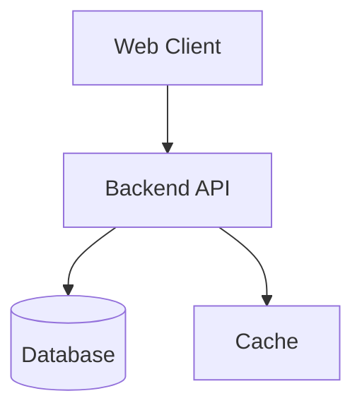

# Technical Architecture Guide

Use this reference for architecture, integration, deployment, and system design documents. Start with `detail-doc-guide.md` for the document shell.

Apply the skill language policy. Localize human-facing headings and descriptions, but keep service names, API routes, class names, ports, commands, environment names, and Mermaid syntax unchanged.

## Body Sections

````markdown
## Overview

- **Purpose**: [What system or feature architecture this document defines.]
- **Scope**: [In-scope clients, services, infrastructure, and integrations.]
- **Audience**: [Engineering team, platform team, security reviewers, etc.]

## System Diagram



## Components

| Component | Technology | Responsibility | Port or Endpoint |
|---|---|---|---|
| Web Client | React + Vite | User interface | 5173 |
| Backend API | .NET | Business logic and REST API | 5000 |

## Data Flow

| Step | Source | Target | Description |
|---|---|---|---|
| 1 | Web Client | Backend API | Sends authenticated request |
| 2 | Backend API | Database | Reads or writes domain data |

## Security Design

| Area | Mechanism | Notes |
|---|---|---|
| Authentication | JWT | Access and refresh token flow |
| Authorization | Role-based access | Admin and user roles |

## Environments

| Environment | Host or Target | Notes |
|---|---|---|
| Local | localhost | Developer workstation |
| Staging | [TODO: add staging target] | QA and release validation |
| Production | [TODO: add production target] | Live service |
````

## Checklist

- [ ] Verify components, ports, and integrations against source/config when available.
- [ ] Keep Mermaid syntax valid.
- [ ] Link related API, ERD, requirements, and runbook docs through the related-documents section.
