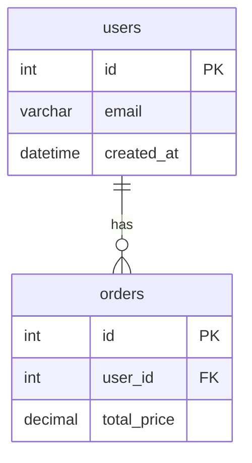
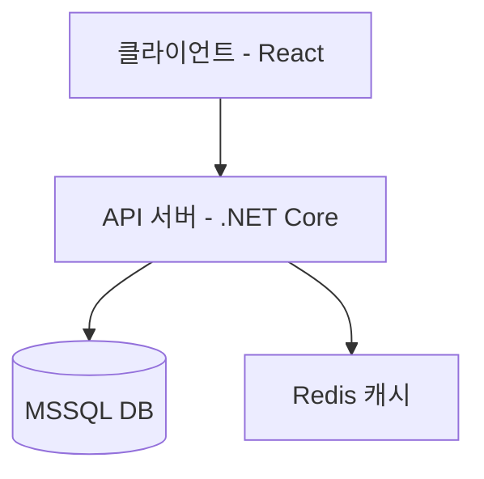

# 기술 설계 문서 가이드

기술 설계 문서는 ERD, 시스템 아키텍처, API 설계 등 기술적인 구조를 명확하게 기록하는 문서다.

---

## ERD 문서 템플릿

```markdown
---
문서제목: [서비스명] ERD 설계서
문서유형: ERD
작성일: YYYY-MM-DD
최종수정: YYYY-MM-DD
버전: v1.0
상태: 초안
태그: [DB, ERD, MSSQL]
---

# [서비스명] ERD 설계서

## 개요

- **목적**: 이 문서는 [서비스명]의 데이터베이스 구조를 정의한다.
- **DB 종류**: MSSQL / PostgreSQL / MySQL 등
- **독자 대상**: 백엔드 개발자, DBA

## 엔티티 목록

| 엔티티명(테이블) | 한국어명 | 설명 |
|---|---|---|
| users | 사용자 | 서비스 이용자 정보 |
| orders | 주문 | 사용자 주문 내역 |

## 엔티티 상세

### users (사용자)

| 컬럼명 | 데이터타입 | NULL 허용 | 기본값 | 설명 |
|---|---|---|---|---|
| id | INT | NO | AUTO_INCREMENT | PK, 사용자 고유 ID |
| email | VARCHAR(255) | NO | - | 로그인 이메일 (UNIQUE) |
| created_at | DATETIME | NO | GETDATE() | 생성일시 |

### orders (주문)

| 컬럼명 | 데이터타입 | NULL 허용 | 기본값 | 설명 |
|---|---|---|---|---|
| id | INT | NO | AUTO_INCREMENT | PK, 주문 고유 ID |
| user_id | INT | NO | - | FK → users.id |
| total_price | DECIMAL(10,2) | NO | - | 주문 총금액 |

## 관계 정의

| 관계 | 유형 | 설명 |
|---|---|---|
| users → orders | 1:N | 한 사용자는 여러 주문을 가질 수 있다 |

## 인덱스 정의

| 테이블 | 인덱스명 | 대상 컬럼 | 유형 |
|---|---|---|---|
| users | idx_users_email | email | UNIQUE |
| orders | idx_orders_user_id | user_id | INDEX |

## Mermaid ERD 다이어그램



## 변경이력

| 버전 | 날짜 | 작성자 | 변경내용 |
|---|---|---|---|
| v1.0 | YYYY-MM-DD | - | 최초 작성 |
```

---

## 아키텍처 설계 문서 템플릿

```markdown
---
문서제목: [서비스명] 시스템 아키텍처 설계서
문서유형: 아키텍처
작성일: YYYY-MM-DD
최종수정: YYYY-MM-DD
버전: v1.0
상태: 초안
태그: [아키텍처, 인프라, 시스템설계]
---

# [서비스명] 시스템 아키텍처 설계서

## 개요

- **목적**: [서비스명]의 전체 시스템 구조와 컴포넌트 간 관계를 정의한다.
- **기술 스택 요약**:
  - Frontend: Vite + React + TypeScript + Tailwind CSS
  - Backend: .NET Core C#
  - Database: MSSQL
- **독자 대상**: 개발팀 전체

## 시스템 구성도



## 컴포넌트 상세

| 컴포넌트 | 기술 | 역할 | 포트 |
|---|---|---|---|
| Frontend | React + Vite | 사용자 인터페이스 | 5173 |
| Backend API | .NET Core C# | 비즈니스 로직, REST API | 5000 |
| Database | MSSQL | 데이터 영속성 | 1433 |

## API 엔드포인트 개요

| 메서드 | 경로 | 설명 | 인증 필요 |
|---|---|---|---|
| GET | /api/users | 사용자 목록 조회 | Y |
| POST | /api/users | 사용자 생성 | N |
| GET | /api/orders/{id} | 주문 상세 조회 | Y |

## 보안 설계

| 항목 | 방식 | 설명 |
|---|---|---|
| 인증 | JWT | Access Token + Refresh Token |
| 권한 | Role-based | Admin / User 구분 |
| 통신 | HTTPS | 전 구간 암호화 |

## 배포 환경

| 환경 | 서버 | 설명 |
|---|---|---|
| 개발 (dev) | localhost | 로컬 개발 환경 |
| 스테이징 (stage) | [TODO] | QA 테스트 환경 |
| 운영 (prod) | [TODO] | 실서비스 환경 |

## 변경이력

| 버전 | 날짜 | 작성자 | 변경내용 |
|---|---|---|---|
| v1.0 | YYYY-MM-DD | - | 최초 작성 |
```
