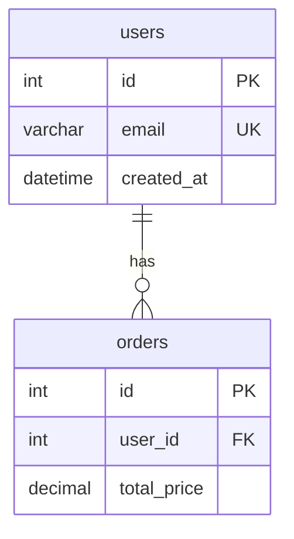
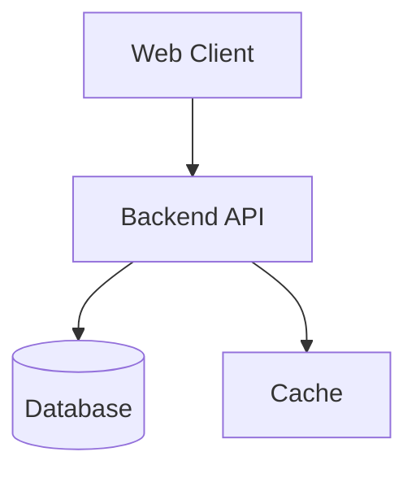

# Technical Design Guide

Use this reference for ERD, architecture, API, integration, and system design documents. Start with the shell in `detail-doc-guide.md`, then choose the relevant body sections below.

Apply the skill language policy. Localize human-facing headings and descriptions, but keep technical identifiers such as table names, column names, API routes, class names, service names, ports, commands, and Mermaid syntax unchanged.

## ERD Body Sections

````markdown
## Overview

- **Purpose**: [What data model this document defines.]
- **Database**: [MSSQL | PostgreSQL | MySQL | SQLite | Other]
- **Audience**: [Backend engineers, DBA, data engineers, etc.]

## Entity List

| Entity | Table | Description |
|---|---|---|
| User | `users` | Stores application user accounts |
| Order | `orders` | Stores purchase orders |

## Entity Details

### `users`

| Column | Type | Null | Default | Key | Description |
|---|---|---|---|---|---|
| id | INT | NO | AUTO_INCREMENT | PK | Unique user ID |
| email | VARCHAR(255) | NO | - | UNIQUE | Login email |
| created_at | DATETIME | NO | CURRENT_TIMESTAMP | - | Creation timestamp |

### `orders`

| Column | Type | Null | Default | Key | Description |
|---|---|---|---|---|---|
| id | INT | NO | AUTO_INCREMENT | PK | Unique order ID |
| user_id | INT | NO | - | FK | References `users.id` |
| total_price | DECIMAL(10,2) | NO | - | - | Order total |

## Relationships

| From | To | Cardinality | Description |
|---|---|---|---|
| `users.id` | `orders.user_id` | 1:N | One user can have many orders |

## Indexes

| Table | Index | Columns | Type | Purpose |
|---|---|---|---|---|
| users | idx_users_email | email | UNIQUE | Prevent duplicate login emails |
| orders | idx_orders_user_id | user_id | INDEX | Speed up user order lookups |

## ERD Diagram


````

## Architecture Body Sections

````markdown
## Overview

- **Purpose**: [What system or feature architecture this document defines.]
- **Scope**: [In-scope services, clients, infrastructure, and integrations.]
- **Audience**: [Engineering team, platform team, security reviewers, etc.]

## System Diagram



## Components

| Component | Technology | Responsibility | Port or Endpoint |
|---|---|---|---|
| Web Client | React + Vite | User interface | 5173 |
| Backend API | .NET | Business logic and REST API | 5000 |
| Database | MSSQL | Persistent data storage | 1433 |

## Data Flow

| Step | Source | Target | Description |
|---|---|---|---|
| 1 | Web Client | Backend API | Sends authenticated request |
| 2 | Backend API | Database | Reads or writes domain data |

## Security Design

| Area | Mechanism | Notes |
|---|---|---|
| Authentication | JWT | Access and refresh token flow |
| Authorization | Role-based access | Admin and user roles |
| Transport | HTTPS | Required outside local development |

## Environments

| Environment | Host or Target | Notes |
|---|---|---|
| Local | localhost | Developer workstation |
| Staging | [TODO: add staging target] | QA and release validation |
| Production | [TODO: add production target] | Live service |
````

## API Body Sections

````markdown
## Overview

- **Purpose**: [What API surface this document defines.]
- **Base URL**: `/api`
- **Authentication**: [None | JWT | Session | API key]

## Endpoint Summary

| Method | Path | Description | Auth |
|---|---|---|---|
| GET | `/api/users` | List users | Required |
| POST | `/api/users` | Create user | Required |
| GET | `/api/users/{id}` | Get user details | Required |

## Endpoint Details

### `GET /api/users`

**Purpose**

[Explain what this endpoint returns.]

**Request**

| Field | Location | Type | Required | Description |
|---|---|---|---|---|
| page | Query | integer | No | Page number |
| page_size | Query | integer | No | Items per page |

**Response**

```json
{
  "items": [],
  "total": 0
}
```

**Errors**

| Status | Code | Condition |
|---|---|---|
| 401 | UNAUTHORIZED | Missing or invalid credentials |
| 500 | INTERNAL_ERROR | Unexpected server failure |
````

## Technical Design Checklist

- [ ] Use project-specific technologies instead of placeholder stacks.
- [ ] Keep Mermaid syntax valid.
- [ ] Verify API paths and database identifiers against source code when available.
- [ ] Mark unknown infrastructure, hostnames, ports, or owners with `[TODO: ...]`.
- [ ] Link related requirements, API docs, ERDs, and architecture docs through the related-documents section.
