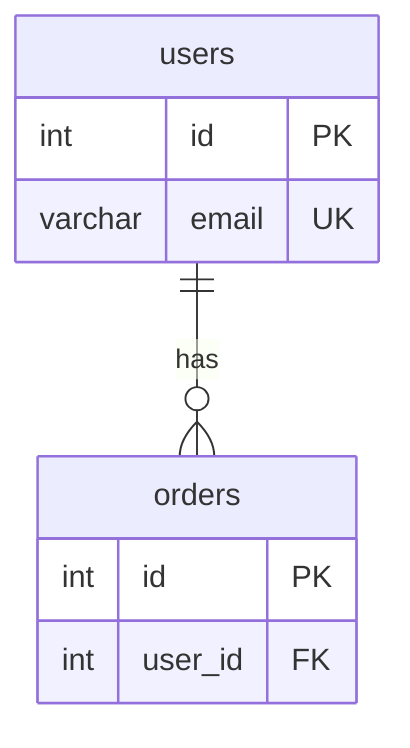

# Technical ERD Guide

Use this reference for ERD and database schema documents. Start with `detail-doc-guide.md` for the document shell.

Apply the skill language policy. Localize human-facing headings and descriptions, but keep table names, column names, keys, indexes, SQL types, and Mermaid syntax unchanged.

## Body Sections

````markdown
## Overview

- **Purpose**: [What data model this document defines.]
- **Database**: [MSSQL | PostgreSQL | MySQL | SQLite | Other]
- **Audience**: [Backend engineers, DBA, data engineers, etc.]

## Entity List

| Entity | Table | Description |
|---|---|---|
| User | `users` | Stores application user accounts |

## Entity Details

### `users`

| Column | Type | Null | Default | Key | Description |
|---|---|---|---|---|---|
| id | INT | NO | AUTO_INCREMENT | PK | Unique user ID |
| email | VARCHAR(255) | NO | - | UNIQUE | Login email |

## Relationships

| From | To | Cardinality | Description |
|---|---|---|---|
| `users.id` | `orders.user_id` | 1:N | One user can have many orders |

## Indexes

| Table | Index | Columns | Type | Purpose |
|---|---|---|---|---|
| users | idx_users_email | email | UNIQUE | Prevent duplicate login emails |

## ERD Diagram


````

## Checklist

- [ ] Verify table and column names against schema or migrations when available.
- [ ] Mark unknown columns, indexes, or relations with `[TODO: ...]`.
- [ ] Link related API, architecture, and requirement docs through the related-documents section.
